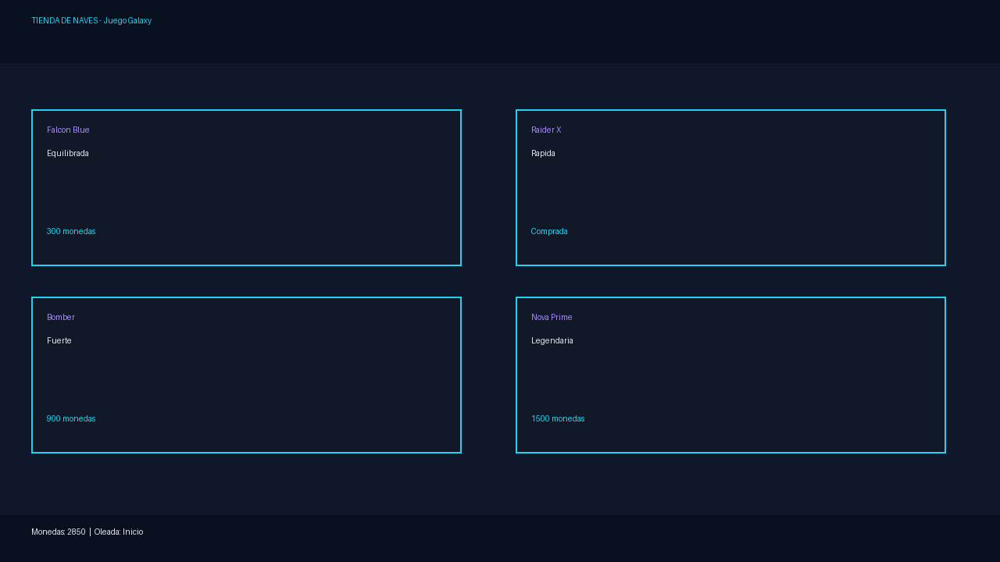
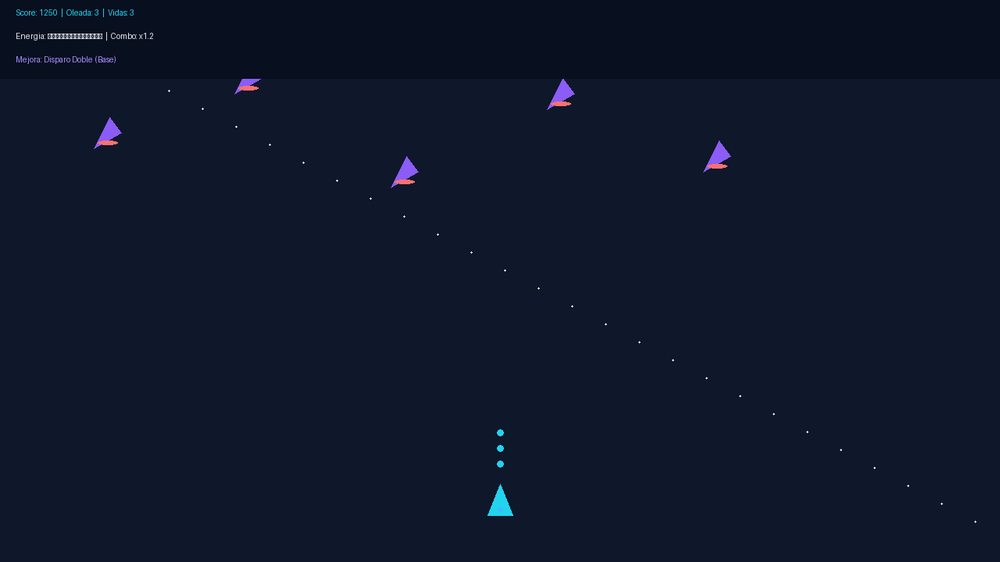
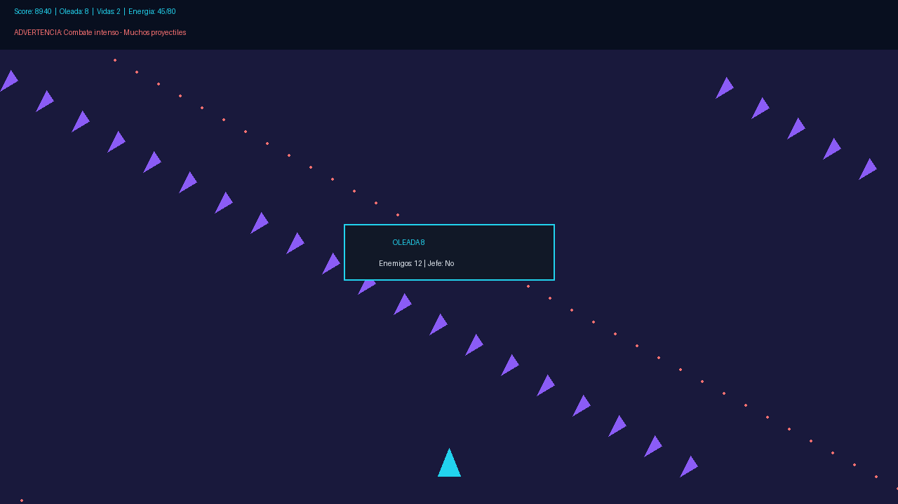
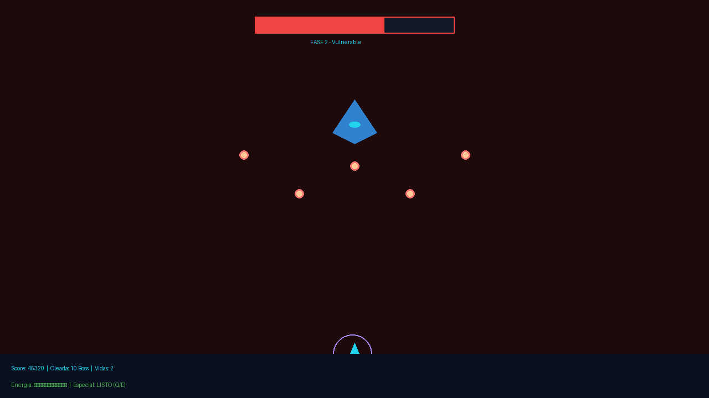
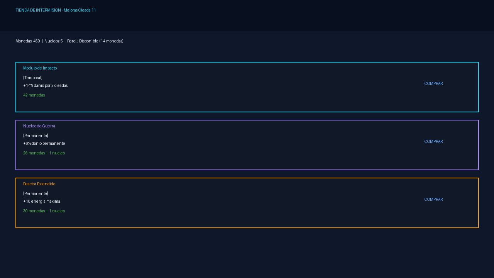

# 🚀 Juego Galaxy - Space Shooter Roguelike

Un shooter espacial roguelike de ritmo rápido con combate intenso, progresión dinámica y sistema de naves personalizables.

### 🖼️ Galería de Imágenes

#### Menú y Tienda

*Selecciona entre 8+ naves con estadísticas únicas*

#### Gameplay Principal

*Esquiva enemigos y dispara con múltiples modos de fuego*

#### Oleadas Intensas

*Pantalla llena de proyectiles enemigos y tus balas*

#### Boss Fight

*Ataca patrones complejos con ventanas de vulnerabilidad*

#### Intermisión - Tienda de Mejoras

*Compra mejoras permanentes o temporales para progresar*

---

## 📋 Tabla de Contenidos
- [Jugabilidad](#-jugabilidad)
- [Programación](#-programación)

---

## 🎮 JUGABILIDAD

### Overview
**Galaxy** es un juego de disparos vertical intenso donde controlas una nave espacial para sobrevivir oleadas de enemigos progresivamente más difíciles. El objetivo es alcanzar la ola más alta posible mientras acumulas mejoras, esquivas enemigos y completas objetivos especiales.

### Mecánicas Principales

#### 🎯 Combate
- **Disparos**: Espacio para disparar
  - Múltiples modos: Disparo simple, doble, cono, amplio, francotirador
  - Sistema de mejoras temporales (power-ups) que modifican patrones de fuego
  - Retroceso visual y retroalimentación sensorial

- **Dash/Esquiva**: Shift para un dash rápido
  - Invulnerabilidad temporal durante el dash
  - Disponible cada 24+ frames (depende de la nave)
  - Costo estratégico por enfriamiento

- **Abilidad Especial**: Q/E para activar poder especial
  - Se carga durante el combate
  - Elimina proyectiles enemigos
  - Inflige daño a todos los enemigos
  - Efecto visual explosivo con pulso de ondas

#### 🌊 Oleadas y Dificultad Escalable
- Sistema de oleadas progresivas (1-indefinidas)
- Enemigos con diferentes roles: Cazadores, Guardianes, Francotiradores, etc.
- Jefe único por oleada con múltiples fases de combate
- Dificultad configurable: Easy, Normal, Hard

#### 🛸 Naves Personalizables
- **Múltiples skins** con estadísticas únicas:
  - Velocidad base (±10%)
  - Cadencia de disparo optimizada
  - Energía máxima
  - Bonificaciones de dash
  
- **Ejemplos de naves**:
  - Falcon Blue: Equilibrada
  - Raider X: Velocidad alta
  - Bomber: Fuerte pero lenta

#### 💎 Sistema de Economía - Intermisión
Entre oleadas accedes a la **Tienda de Intermisión** donde:
- **Compras mejoras permanentes** (Núcleos de guerra, Reactores)
- **Activas buffs temporales** (Módulo de impacto, Inyector de cadencia)
- **Tomas decisiones estratégicas** con presupuesto limitado

| Tipo | Duración | Ejemplo |
|------|----------|---------|
| Permanente | ∞ | +6% daño |
| Temporal | 2 oleadas | +14% daño |
| Transmutación | 1 acción | Convertir buff temporal a permanente |

#### 🎪 Eventos Especiales
- Oleadas de bonificación con mayor spawn
- Interferencia visual que reduce visibilidad
- Campos magnéticos que atraen poder-ups
- Niebla que limita línea de visión

#### 🏆 Sistema de Objetivos
Cada oleada presenta un objetivo:
- **Supervivencia**: Aguanta X segundos
- **Asesinatos**: Derrota X enemigos
- **Ataques agresivos**: Mata X enemigos en zona de riesgo
- **Jefaturas**: Derrota a enemigos élite sin daño

Cumplir objetivos da monedas y núcleos extras.

#### 🔥 Combo y Momentum
- **Combo Multiplier**: Se activa por matar enemigos agresivamente
- Decaimiento automático si no matas
- Max x4.0 (con 12 stacks)
- Bonifica experiencia y monedas

#### 🎵 Controles

| Acción | Tecla |
|--------|-------|
| Izquierda | A / ← |
| Derecha | D / → |
| Arriba | W / ↑ |
| Abajo | S / ↓ |
| Disparo | Espacio |
| Dash | Shift |
| Especial | Q / E |
| Pausa | ESC |
| Pantalla completa | F11 |

#### ⚙️ Configuración de Jugador
- **Dificultad**: Afecta velocidad enemiga, daño y spawns
- **Modo visual**: Estándar o Lite (rendimiento)
- **Densidad HUD**: Normal o Compacto
- **Anti-flicker**: Modo daltónico integrado
- **Audio**: Control de volumen por canal (música, SFX, UI)

---

## 👨‍💻 PROGRAMACIÓN

### Arquitectura del Proyecto

```
Juego Galaxy/
├── index.html              # Entrada HTML + Canvas
├── css/
│   ├── base.css           # Estilos base
│   ├── layout.css         # Layout y grid
│   ├── components.css     # Componentes UI
│   ├── menu.css           # Menú y tienda
│   ├── tokens.css         # Tokens de diseño
│   └── style.css          # Estilos globales
└── js/
    ├── main.js            # Game loop y entrada
    ├── core/
    │   ├── constants.js   # Configuración global
    │   ├── helpers.js     # Utilidades matemáticas
    │   └── state.js       # Variables de estado
    ├── gameplay/
    │   ├── game-loop.js      # Update principal
    │   ├── player-combat.js  # Sistema de armas
    │   ├── boss.js           # Jefe y patrones
    │   ├── enemies.js        # Enemigos y spawning
    │   ├── collisions.js     # Física y colisiones
    │   ├── power-ups.js      # Sistema de mejoras
    │   └── session.js        # Estado de sesión
    ├── render/
    │   └── render.js      # Renderizado 2D Canvas
    └── ui/
        └── ui.js          # Menú, HUD, tienda
```

### Stack Tecnológico
- **Frontend**: HTML5 Canvas 2D + JavaScript vanilla
- **Sin dependencias externas** (excepto audio WebAudio API)
- **Rendimiento**: Optimizado para 60 FPS con downscaling dinámico

### Sistemas Principales

#### 1. **Game Loop** (`js/main.js`)
```javascript
function gameLoop(timestamp) {
  // 1. Acumular delta time
  // 2. Ejecutar frames de actualización (fixed timestep 60 FPS)
  // 3. Renderizar escena
  // 4. Solicitar siguiente frame
}
```
- Frame rate independence con accumulator
- Catch-up automático si juego se rezaga
- requestAnimationFrame para sincronización

#### 2. **Sistema de Combate** (`js/gameplay/player-combat.js`)
```javascript
8 modos de disparo:
├─ single    (1 bala)
├─ double    (2 balas espaciadas)
├─ cone      (3 balas en abanico)
├─ wide      (6 balas amplio)
├─ sniper    (1 bala gigante, 2.6x fuego lento)
├─ rapid     (-65% cadencia)
├─ volley    (+2 balas laterales)
└─ back      (+cañón trasero)

Modificadores compatibles:
├─ ricochet  (rebote en bordes)
└─ overcharge (+35% daño, +22% velocidad)
```

#### 3. **IA de Enemigos** (`js/gameplay/enemies.js`)
```javascript
Razas enemigo:
├─ Romulan  (rápido, patrón fan)
├─ Klingon  (tanque, descarga doble)
└─ Dominion (equilibrado)

Movimientos:
├─ Hunt     (persigue jugador)
├─ Zone     (ocupa áreas)
├─ Guard    (formación defensiva)
├─ Zigzag   (patrón ondulado)
├─ Sweep    (barrido lateral)
└─ Erratic  (caótico)

Fase-shift: Al 50% HP, enemigo cambia comportamiento + aumenta fuego
```

#### 4. **Jefe (Boss)** (`js/gameplay/boss.js`)
```javascript
3 Fases dinámicas según salud:
├─ Fase 1 (100-66%): 3 patrones
├─ Fase 2 (66-33%):  5 patrones
└─ Fase 3 (<33%):   7 patrones + orbitas rastreables

Patrones de fuego:
├─ Lanzas (5+ proyectiles direccionados)
├─ Orbitas (2-3 bolas de plasma rastreables)
├─ Ráfaga circular (4 + en fase 3)
└─ Ventilador radial (6 en fase 3)

Dificultad escala: HP +30% por ola, patrones más rápidos
```

#### 5. **Colisiones** (`js/gameplay/collisions.js`)
```javascript
Tipos:
├─ Bala vs Enemigo (reduce HP enemigo)
├─ Bala vs Jefe (daño x0.72 normal, x1.45 en ventana crítica)
├─ Proyectil vs Jugador (reduce energía)
├─ Contacto vs Jugador (instadaño)

Optimización: hitboxes reducidos (~60% del visual)
```

#### 6. **Sistema de Mejoras** (`js/gameplay/power-ups.js`)
```javascript
Compatibilidad de modos:
├─ Spread (mutuamente exclusiv): [double, cone, wide, sniper]
│   └─ Se reemplazan entre sí
├─ Modificadores: [rapid, volley, overcharge, back, ricochet]
│   └─ Pueden apilarse
└─ Restricciones especiales:
    ├─ Sniper incompatible con volley/overcharge
    └─ Wide incompatible con volley
```

#### 7. **Renderizado** (`js/render/render.js`)
```javascript
Técnicas visuales:
├─ Naves dibujadas proceduralmente (código puro, sin sprites)
├─ Gradientes para profundidad
├─ Shadow blur para glow effects
├─ Partículas de motor
├─ Explosiones micro con impacto físico
├─ Bloom falso (lighten blend mode)
├─ Paralaje de estrellas 3 capas
├─ Efectos de daño dinámicos (cicatrices)

Optimizaciones rendering:
├─ Lite mode si >N proyectiles
├─ Reduced transparency en caos
├─ Star culling dinámico
└─ Canvas context pooling
```

#### 8. **Audio Adaptivo** (`audioEngine`)
```javascript
Buses de audio:
├─ Master (principal)
├─ Music (música dinámica)
├─ SFX (efectos)
└─ UI (sonidos interfaz)

Efectos incluidos:
├─ Disparo con variación de pitch
├─ Combo stingers cada 5 stacks
├─ Sonidos de dash, especial, recarga
├─ Feedback de daño y UI
└─ Música adaptativa según intensidad
```

#### 9. **Sistema de Estado** (`js/core/state.js`)
```javascript
Variables globales principales:
├─ player        (nave activa)
├─ enemies[]     (array dinámica)
├─ bullets[]     (proyectiles jugador)
├─ enemyProjectiles[]
├─ powerUps[]
├─ boss          (jefe actual)
├─ wave          (número ola)
├─ score         (puntuación)
├─ lives         (vidas restantes)
└─ phase         ("playing" | "paused" | "gameover" | "intermission")
```

#### 10. **Tienda de Intermisión** (`js/ui/ui.js`)
```javascript
Pool de ofertas dinámicas:
├─ 3 slots visibles
├─ Bloqueo de 1 oferta (1 núcleo)
├─ 1 Reroll por intermisión (14 monedas)
├─ Transmutación de buff temporal (variable núcleos)

Tipos de oferta:
├─ Permanente  (+stats para siempre)
├─ Temporal    (+stats X oleadas)
├─ Rescate     (si vida baja)
├─ Liquidez    (si monedas bajas)
└─ Riesgo      (si run forte)

Sistema de rareza:
├─ Estándar   (comúnmente disponible)
├─ Rara       (costo más alto)
├─ Legendaria (8-44% drop rate, pity counter)
```

### Patrones de Código

#### Inicialización
```javascript
// 1.Constants cargadas (GAME_TUNING, DIFFICULTIES, etc)
// 2. Audio engine inicializado
// 3. Canvas preparado
// 4. Event listeners agregados
// 5. Render shop
// 6. Start game loop
```

#### Update Pattern
```javascript
// Por cada frame:
1. Validar estado (running, player vivo)
2. Actualizar input (keys)
3. Actualizar física (movimiento jugador)
4. Actualizar enemigos (IA, spawning)
5. Actualizar proyectiles
6. Resolver colisiones
7. Actualizar FX (partículas, texto flotante)
8. Renderizar todo
```

### Optimizaciones de Rendimiento

| Técnica | Impacto |
|---------|---------|
| Fixed timestep (60 FPS) | Determinismo + rendimiento |
| Lite mode automático | Mantiene 60 FPS con 300+ proyectiles |
| Object pooling | Reduce GC pressure |
| Precálculo de trigonometría | Fase y animación sin sin()/cos() cada frame |
| Canvas state caching | Menos ctx.save()/restore() innecesarios |
| Bullet trail rendering | Solo 2 puntos previos, no histórico completo |

### Flujo de Datos

```
Input → Update State → Collisions → Render
   ↓                        ↓
 Keys                   Physics
 Input                  Damage
 Buttons                Score
```

### Notas de Desarrollo

- **No hay dependencias externas** (propósito educativo)
- **localStorage** para persistencia (skins comprados, settings)
- **Responsive**: Funciona desktop y tablets (touch/mouse)
- **Accesibilidad**: ARIA labels, high contrast mode, navegación teclado
- **Debugging**: Hitbox overlay (B), control de boss fire rate (-/+), rastreo orb ([/])

---

## 🚀 Cómo Ejecutar

1. Abre `index.html` en navegador moderno
2. Selecciona nave
3. Elige dificultad
4. Presiona "Comenzar"

**Requisitos**: Navegador con soporte Canvas 2D + WebAudio API

---

## 🎨 Visual Style

- **Sci-Fi Neon**: Naves dibujadas con gradientes y glow effects
- **Sin sprites**: Todo proceduralmente generado
- **Tema dinámico**: Colores cambian por bioma (ola)
- **Paralaje de fondo**: Nebulosas animadas y estrellas flotantes

---

## 📊 Estadísticas del Proyecto

- **Líneas de código**: ~4000+ (JS puro)
- **Sistemas principales**: 10+
- **Enemigos únicos**: 9 (3 razas × 3 roles)
- **Modos de disparo**: 8+
- **Skins de naves**: 8+
- **Ofertas de tienda**: 12+ dinámicas

---

## 📝 Licencia

Proyecto libre para uso educativo y no comercial.

---

## 📸 Screenshots - Estado Actual

Los screenshots están listos para ser agregados. Ver instrucciones detalladas en:
[`assets/screenshots/README.md`](assets/screenshots/README.md)

**Archivos necesarios:**
- ✅ `01-shop.png` - Pantalla de tienda
- ✅ `02-gameplay.png` - Gameplay tranquilo
- ✅ `03-wave.png` - Oleada intensa  
- ✅ `04-boss.png` - Boss fight
- ✅ `05-intermission.png` - Tienda de intermisión

> **Nota**: Los placeholders arriba se actualizarán automáticamente al agregar las imágenes PNG a `assets/screenshots/`

---

## 🤝 Contribuir Screenshots

1. Captura una pantalla del juego siguiendo las recomendaciones
2. Guarda como `0X-nombre.png` en `assets/screenshots/`
3. Verifica que se vea bien en GitHub
4. Actualiza fecha en `assets/screenshots/README.md`

**Requisitos mínimos:**
- Resolución: 1280x720 o superior
- Formato: PNG
- Tamaño: <500KB
- Sin watermarks o elementos externos

---

**Versión**: 1.0 | **Última actualización**: Abril 2026